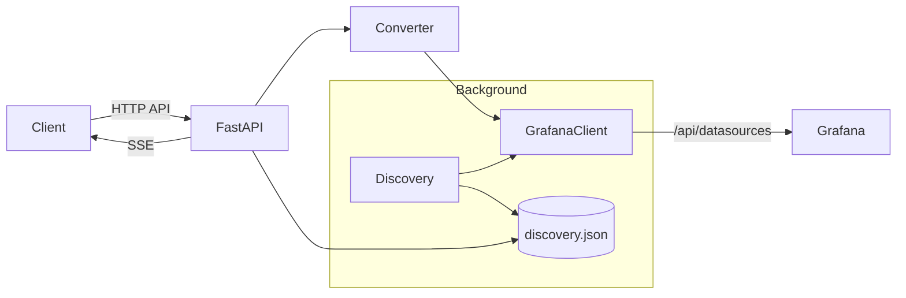

<!-- Copyright (c) 2025, Project Grafana Query MCP. All rights reserved. -->

# 系统架构设计文档

## 概述
- 组件：`FastAPI` 应用、`Discovery` 后台循环、`Grafana Client` 调用层、`Converter` 转换层、`TTLCache` 缓存
- 数据流：请求解析 → 自动选择数据源 → 转换为 Grafana 查询 → 执行并分页返回 → 记录命中用于自适应

## 架构图（Mermaid）

## 模块职责
- FastAPI：路由、认证、SSE 分页、指标导出（`app/main.py`）
- Discovery：定期扫描数据源、Dashboards、Prom/ES 指标名与字段（`app/discovery.py`）
- Grafana Client：封装 HTTP、重试、代理调用（`app/clients/grafana.py`）
- Converter：业务解析参数到 Grafana 查询（`app/converter/grafana.py`）
- Cache：AES-GCM 加密的 TTL 内存缓存（`app/utils/cache.py`）

## 性能与可靠性
- 重试策略：指数退避有限重试（客户端层）
- 节流策略：Discovery 并发上限与刷新最小间隔（环境项可调）
- 观测性：Prometheus 指标、JSON 结构化日志

## 安全
- Bearer Token 认证与速率限制
- 避免密钥落盘：`.env.example` 不含真实值，`.env` 不入库

## 版本变更记录
- v0.1.0：初版架构图与模块职责说明；补充节流与安全策略
